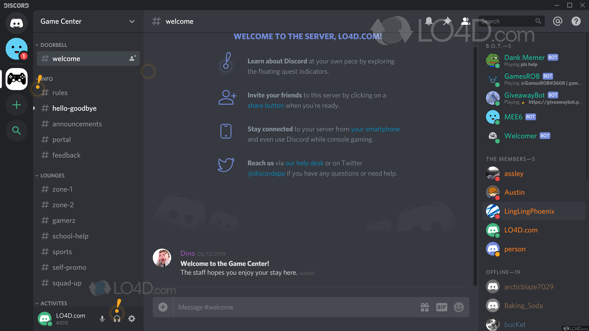

## Тестовое задание **JavaScript Developer**

**Срок выполнения до 3 дней.**

Электронная почта для связи: job@fntastic.com

По любым вопросам можете писать на почту с пометкой **`JS Developer`** и указанием вашего ФИО и ссылки на резюме.

Решение отправляйте ссылкой на ваш репозиторий (`GitHub` или `GitLab`), он должен быть публичный.

Решение рассматривается в течении 3-4 рабочих дней.

Пакетный менеджер - `npm`.

Надо создать одно окно наподобие основного окна приложения `Discord`, используя любые инструменты, которые вам будут удобны (напишите о них). Ниже будет представлена ссылка на референс.

1. В первую очередь будет оцениваться качество верстки и анимации.

2. Желательно использовать какой-нибудь `CSS` фреймворк на ваш выбор (`tailwindcss`, `bootstrap` и т.д.)

3. Копировать стиль 1-в-1 не надо, у вас есть возможность проявить свою креативность, можете переработать стиль, но общий макет с блоками каналов, чата и пользователями оставить на своих местах.

4. Цветовую схему лучше сохранить в **темных**, либо серых тонах.

5. Передавать весь дизайн на верстку не надо.
   Заполните страницу тестовым набором данных для наглядности.

6. Все интерактивные элементы должны реагировать на нажатие.

7. К решению вам также нужно будет написать сопроводительный документ, в котором вам надо написать то, как приложение должно реагировать на нажатия по тем или иным областям, кнопкам, какие анимации должны проигрываться, также на ваше усмотрение.

#### **Fntastic Human Possibilities**
